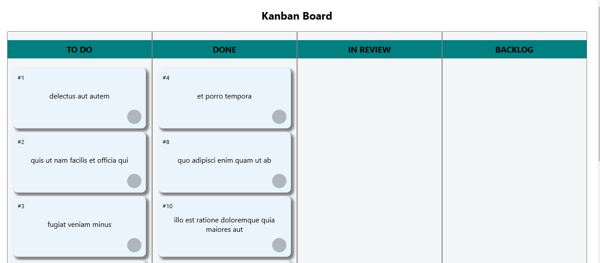

# BoardNotes
Drag & Drop cards between different columns that works like a kanban board.

This project was bootstrapped with Create React App.

# How to Run
In the project directory, you can run:

npm install

npm install react-scripts

npm start

# Repo Link
https://github.com/Dsien/BoardNotes.git